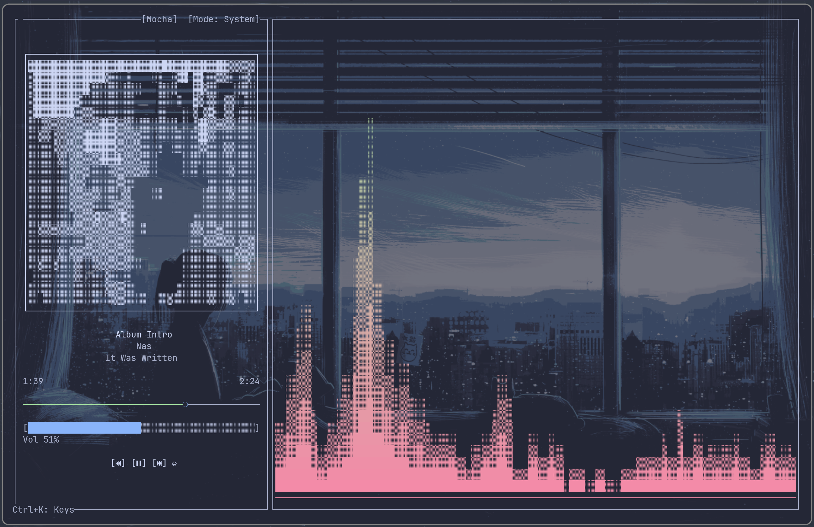

<p align="center">
  
</p>

<h1 align="center">CLI Music Player</h1>

<p align="center">
	<a href="README.md">English</a>
	&nbsp;&nbsp;&nbsp;|&nbsp;&nbsp;&nbsp;
	<a href="README_zh-CN.md">简体中文</a>
</p>

<p align="center" style="color:gray;">
	A Rust-based Linux TUI music player with spectrum visualization.
</p>

<p align="center">
	
	
	
	
</p>

<h2 align="center">Project Overview</h2>

This is a Linux terminal (TUI) music player built with Rust.
It supports local playback and system monitoring, and includes spectrum visualization.

<p align="center">
	
</p>

<h2 align="center">Features</h2>

- Local audio playback
- Local Audio Playback Mode Changes (Playlist Loop / Single Track Loop / Sequential Playback / Shuffle)
- Local Audio Equalizer Support
- System playback monitoring (MPRIS)
- Playlist panel
- Album cover rendering: ASCII art (default) or Kitty graphics (optional, if supported)
- Settings modal (theme, transparent background, album border, visualization mode, Bar settings, Kitty graphics toggle, cover quality, lyrics/cover fetch & download, audio fingerprinting, AcoustID API key)
- Lyrics display
- Lyrics fetch: prefers embedded/local LRC (same-name .lrc and lrc/ folder), otherwise async LRCLIB
- Cover fetch: prefers embedded/local cover (including cover/ folder), otherwise async MusicBrainz + Cover Art Archive
- When metadata is missing, optional Chromaprint fingerprint + AcoustID lookup
- Visualization: spectrum bars / oscilloscope (Braille overlay from stereo `cava` bars when available; falls back to internal FFT)

<h2 align="center">Tech Stack</h2>

- Rust 2021
- TUI: ratatui + crossterm
- Playback: rodio (local), MPRIS (system)
- Visualization: `cava` (external bars) or internal FFT fallback

<h2 align="center">Development Setup</h2>

### Terminal Font (⚠️Nerd Font needed)

The control buttons and playback mode indicators use Nerd Font icon glyphs. If your terminal font is not a Nerd Font (patched), you may see missing-glyph boxes.

Recommended fonts: JetBrainsMono Nerd Font, FiraCode Nerd Font, Hack Nerd Font (any Nerd Font works).

Icon mapping:

- Play: 
- Pause: 
- Previous: 
- Next: 
- Shuffle: 
- Repeat one: 
- Repeat all: 
- Sequential: 
> Oops, GitHub doesn't seem to support displaying Nerd Font. You can check the icons at https://www.nerdfonts.com/cheat-sheet.

### Requirements (Linux)

Install build dependencies (names may vary by distro):

```bash
sudo apt update
sudo apt install -y pkg-config libasound2-dev libdbus-1-dev libchromaprint-dev
```

### Run

```bash
cargo run
```

### Release build

```bash
cargo build --release
./target/release/cli-music-player
```

On first run, the app will create (if missing) its config + theme files under your OS config directory.

- Linux: `$XDG_CONFIG_HOME/cli-music-player` (usually `~/.config/cli-music-player`)

You can override the root directory with `CLI_MUSIC_PLAYER_ASSET_DIR` (it will still use `config/` and `themes/` under that root).

<h2 align="center">Spectrum Visualization (cava)</h2>

The app prefers `cava` for system-wide visualization bars (this project renders the style; `cava` only provides numeric bars).
If `cava` is not available, it will fall back to the internal FFT pipeline.

`cava` executable resolution order:

1. `CLI_MUSIC_PLAYER_CAVA` environment variable (absolute/relative path)
2. Next to the app executable: `./cava`
3. Next to the app executable: `./third_party/cava/cava`
4. `cava` in `PATH`

If none of the above are available and the app was built with `--features bundle-cava`, it will extract the embedded `cava` to a temporary directory for the current session.

Install `cava` (optional but recommended):

```bash
# Debian/Ubuntu
sudo apt install -y cava

# Arch
sudo pacman -S cava
```

### Bundle `cava` from source (optional)

If you want the project to build its own `cava` binary automatically (instead of relying on a system package), build with:

```bash
cargo build --release --features bundle-cava
```

This will download and build upstream `cava` from source during the Cargo build, then embed the resulting `cava` binary into the app. At runtime, if no system `cava` is found, the app will extract it into a temporary directory and use it for the current session (it is deleted when the app exits).

Notes:

- Requires network access during the build.
- To work around autotools macro differences on some distros, the build script injects a minimal `AX_CHECK_GL` override via `ACLOCAL_PATH` to avoid `autogen.sh` failing with `_AX_CHECK_GL_MANUAL_LIBS_GENERIC: argument must not be empty`. This only affects the optional SDL/OpenGL output path and does not impact the raw bars output used by this project.
- Requires system build dependencies for `cava` (Ubuntu/Debian example):

```bash
sudo apt update
sudo apt install -y \
	build-essential autoconf automake libtool pkgconf \
	libfftw3-dev libiniparser-dev \
	libasound2-dev libpulse-dev libpipewire-0.3-dev
```

You can override the source/version used by the build script:

```bash
# override tag
CLI_MUSIC_PLAYER_CAVA_BUNDLE_VERSION=0.10.6 cargo build --release --features bundle-cava

# override URL (tar.gz)
CLI_MUSIC_PLAYER_CAVA_BUNDLE_URL=https://github.com/karlstav/cava/archive/refs/tags/0.10.6.tar.gz \
	cargo build --release --features bundle-cava
```

If you want to enable the feature but skip bundling (e.g. distro packaging / CI), you can:

```bash
CLI_MUSIC_PLAYER_CAVA_BUNDLE_SKIP=1 cargo build --release --features bundle-cava
```

### Windows (build notes / limited features)

This project primarily targets Linux. On native Windows you can try “build/local playback”, but these features are not available or not guaranteed:

- System playback monitoring (MPRIS)
- System volume control (`Up`/`Down`)
- `bundle-cava` (autotools-heavy; upstream `cava` capture backends may not be available on Windows)

Recommended: use WSL2 and follow the Linux instructions.

Native Windows (MSVC) build outline:

1. Install Rust via `rustup`
2. Install Visual Studio Build Tools (C++ toolchain)
3. From the repo root:

```bash
cargo build --release
```

<h2 align="center">Configuration</h2>

- `config/default.toml`: UI/spectrum/MPRIS + EQ settings
- `themes/*.toml`: theme definitions

Kitty-related settings (in `config/default.toml`):

- `kitty_graphics`: enable Kitty graphics protocol rendering (default: `false`)
- `kitty_cover_scale_percent`: cover quality in percent (default: `50`; `100` means no downscale)

Bars settings (in `config/default.toml`, bars mode only):

- `super_smooth_bar`: finer height glyphs (default: `false`)
- `bars_gap`: insert a blank column between bars (default: `false`)

Lyrics/cover and fingerprint settings (in `config/default.toml`):

- `lyrics_cover_fetch`: enable async lyrics/cover fetch (default: `false`)
- `lyrics_cover_download`: save fetched lyrics/cover locally (default: `false`)
- `audio_fingerprint`: enable audio fingerprinting (default: `false`, requires AcoustID API key)
- `acoustid_api_key`: AcoustID API key (set via Settings modal)

Downloaded storage paths (when enabled):

- Lyrics: lrc/ folder next to the audio file, same filename (.lrc)
- Cover: cover/ folder next to the audio file, same filename (.jpg/.png)

Default locations (Linux):

- `~/.config/cli-music-player/config/default.toml`
- `~/.config/cli-music-player/themes/*.toml`

<h2 align="center">Keyboard Shortcuts</h2>

Open the in-app help at any time with `Ctrl+K`.

| Key | Action |
|---|---|
| `Ctrl+F` | Open folder input |
| `P` | Toggle playlist |
| `Space` | Play/Pause |
| `Left` / `Right` | Prev / Next |
| `Up` / `Down` | Volume up / down |
| `E` | Open the equalizer (local) |
| `Alt+R` | Reset equalizer to default (in EQ modal) |
| `M` | Toggle repeat mode (local) |
| `T` | Open Settings |
| `Ctrl+K` | Open Keys (help) |
| `Enter` | Confirm (folder input / playlist) |
| `Q` | Quit |
| `Esc` | Close overlays/modals |

When the playlist is open:

| Key | Action |
|---|---|
| `Ctrl+Up` / `Ctrl+Down` | Move selected item up / down |
| `Ctrl+Left` / `Ctrl+Right` | Prev / Next album (MultiAlbum) |

---

### License

[AGPL-3.0 license](LICENSE)

Third-party notices: [THIRD_PARTY_NOTICES.md](THIRD_PARTY_NOTICES.md)
